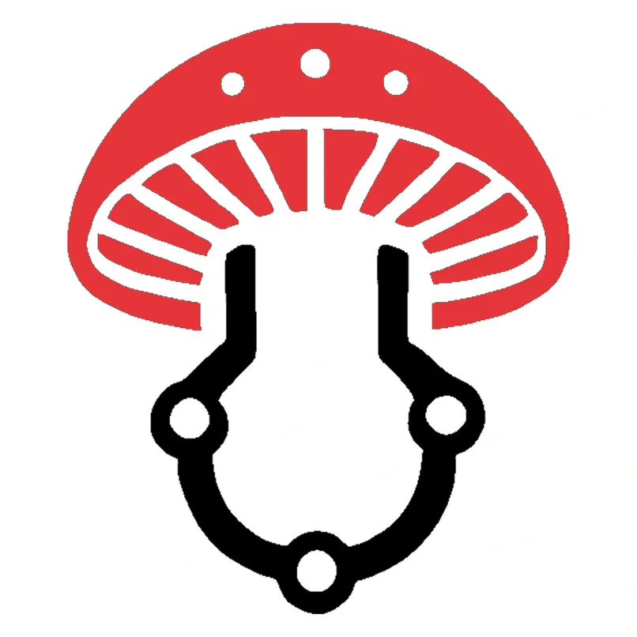
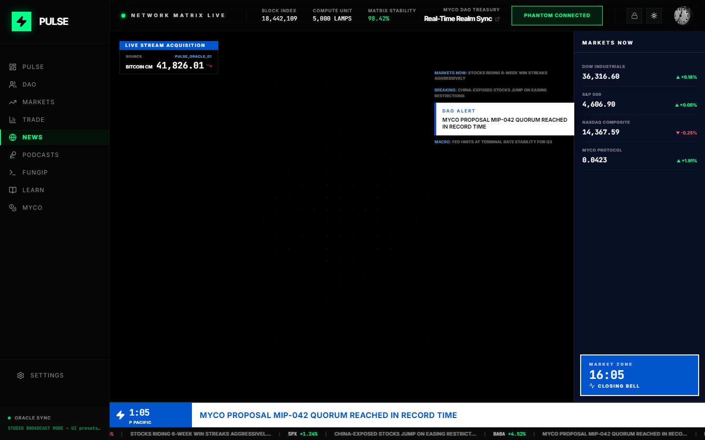
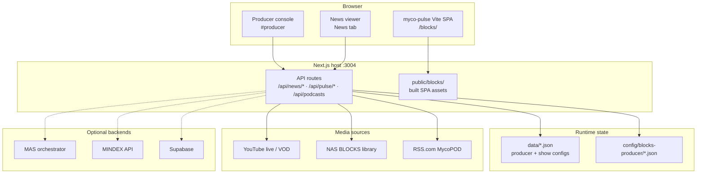
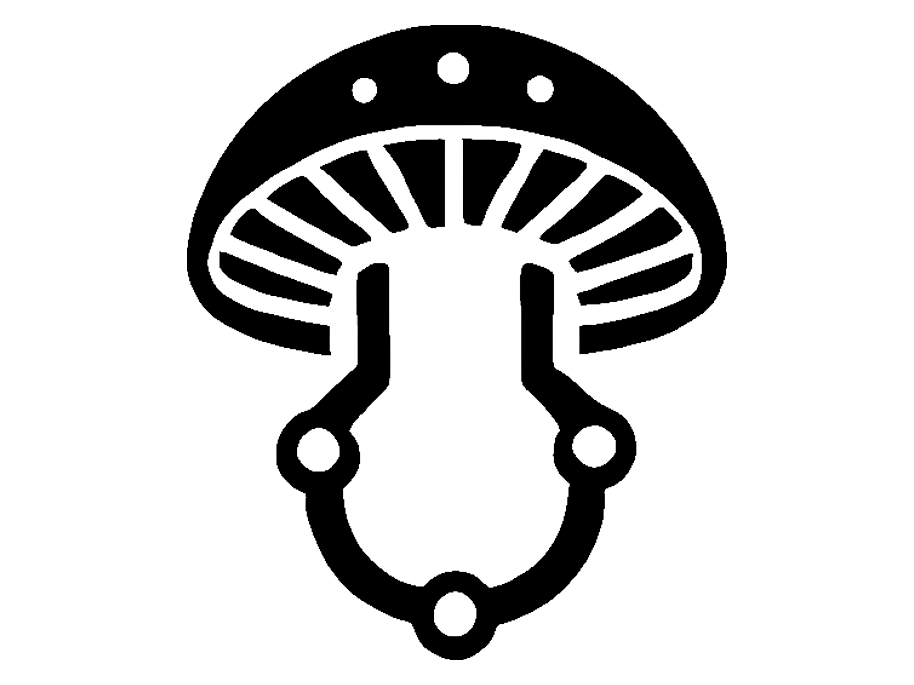

<p align="center">
  
</p>

<h1 align="center">BLOCKS</h1>

<p align="center">
  <strong>Studio-grade broadcast, markets, and DAO operations — built for the fungal economy.</strong>
</p>

<p align="center">
  <a href="https://blocks.mycodao.com"></a>
  <a href="https://mycodao.com"></a>
  <a href="https://github.com/MycoDAO/Blocks/blob/main/LICENSE"></a>
</p>

<p align="center">
  <a href="#what-is-blocks">What is BLOCKS</a> ·
  <a href="#screenshots">Screenshots</a> ·
  <a href="#features">Features</a> ·
  <a href="#producer-console">Producer</a> ·
  <a href="#architecture">Architecture</a> ·
  <a href="#quick-start">Quick start</a> ·
  <a href="#deployment">Deploy</a> ·
  <a href="#development">Development</a>
</p>

---

## What is BLOCKS

**BLOCKS** is the public broadcast and operations surface of [MycoDAO](https://mycodao.com) — a full-stack web platform that combines **live news playout**, **market intelligence**, **podcast distribution**, **DAO governance visibility**, and **scientific research tools** in one responsive studio experience.

Think of it as a **control room + viewer** for MycoDAO: operators run shows from a producer console; audiences watch CNBC-style news with live tickers, talent lower-thirds, and scheduled programming; members explore markets, funding, FungIP, tissue lab data, and learning modules from the same shell.

| | |
|---|---|
| **Production URL** | [https://blocks.mycodao.com](https://blocks.mycodao.com) |
| **Primary app route** | `/blocks/` — Pulse studio SPA |
| **Producer console** | `/blocks/#producer` (authenticated operators) |
| **Stack** | Next.js 14 (API + hosting) + Vite/React **myco-pulse** (studio UI) |
| **Media** | YouTube live, NAS-hosted shows/bumpers/commercials/graphics |

> **Repository note:** This org repo ([MycoDAO/Blocks](https://github.com/MycoDAO/Blocks)) is the **public mirror** of the codebase. Active development continues on the maintainer fork; this repository is kept in sync for transparency and community review.

---

## Screenshots

### News broadcast — studio mode

Live program playout with floating news rail, DAO alerts, market sidebar, and bottom ticker — the same view viewers see when a show is on air.

<p align="center">
  
</p>

<p align="center"><em>News tab · Studio broadcast mode · Real-time overlays and market data</em></p>

---

## Features

### Broadcast & news

| Capability | Description |
|------------|-------------|
| **Live + recorded playout** | YouTube live channels, NAS MP4 shows, bumpers, and commercials |
| **24/7 schedule engine** | Slot-based program rotation with automatic handoffs |
| **CNBC-style viewer** | `NewsBroadcastView` — persistent player, floating rail, market zone |
| **Talent lower-thirds** | Named anchors with role lines; synced to producer state |
| **Market ticker** | Scrolling indices, movers, and custom headline segments |
| **Mobile-ready** | Touch-friendly nav, gesture unlock for news video on iOS/Android |

### Producer console

| Capability | Description |
|------------|-------------|
| **Program presets** | Pre-built shows (Mycosoft Garage, Crypto Corner, Mad Bitcoins, and more) |
| **Per-show configuration** | Title, talent, live data rail, bottom bar, zone graphics, commercials |
| **Go on air / End show** | Start and stop shows with confirmation and clean return-to-live |
| **Push changes live** | Update overlays and copy while a show is already on air |
| **Commercial control** | Manual fire + offset scheduling; auto-resume show after NAS playback |
| **NAS media library** | Browse and assign bumpers, commercials, show masters, and graphics |
| **Show video source** | Pick NAS asset or YouTube URL per program |

### Pulse studio modules

| Tab | What you get |
|-----|----------------|
| **News** | Full broadcast viewer + producer-driven overlays |
| **Pulse** | Customizable dashboard grid — widgets, charts, oracle sync |
| **Podcasts** | **MycoPOD** episodes via RSS (enclosure playback in-app) |
| **Organizations** | DAO / Realms hub — proposals, treasury, realm sync |
| **Funding** | Funding rounds and capital visibility |
| **Research** | Research feed and scientific items |
| **Markets** | Live indices, protocol tokens, session summaries |
| **Trade** | Trading views with wallet integration |
| **FungIP** | Fungal intellectual property terminal |
| **Tissue** | Tissue lab / specimen workflows |
| **Learn** | Guided learning modules |
| **MYCO** | Token and protocol snapshot |

### Platform integrations

- **Solana wallet** — Phantom connect for on-chain actions
- **Supabase** — Auth, logging, and tissue/research data (when configured)
- **MAS / MINDEX / NatureOS** — Optional backend proxies for agents, species, and ops (`check:backends` health script)
- **RSS.com** — MycoPOD podcast feed ingestion
- **Cloudflare** — CDN + tunnel for `blocks.mycodao.com`

---

## Producer console

Operators with allowlisted Google sign-in open the producer at:

```
https://blocks.mycodao.com/blocks/#producer
```

Typical workflow:

1. **Select a program** — Opens the side panel (does not cut to air immediately).
2. **Configure** — Title, talent, news reel mode, bottom bar text, graphics zones, commercial slots.
3. **Save** — Persists `ProgramShowConfig` to server JSON.
4. **Go on air** — Applies config, starts show stream, pushes overlays to the News viewer.
5. **Push changes live** — Re-apply saved config while still on air.
6. **Fire commercial** — Manual NAS commercial; show resumes automatically when playback ends.
7. **End show** — Confirmed shutdown; viewer returns to scheduled live programming.

NAS media layout (production):

| Path | Purpose |
|------|---------|
| `shows/*.mp4` | Recorded program masters |
| `bumpers/*.mp4` | Station IDs and loops |
| `commercials/*.mp4` | Sponsorship / promo spots |
| `graphics/**` | Lower-thirds and fullscreen overlays |

---

## Architecture



### Repository layout

```
├── myco-pulse/          # Vite/React studio (builds → public/blocks/)
├── app/                 # Next.js App Router + API routes
├── lib/server/          # Producer state, program schedule, show configs
├── config/blocks-producer/   # Talent, title, and program presets
├── public/blocks/       # Production SPA bundle
├── docs/                # Operator and deploy documentation
└── scripts/             # Deploy, smoke tests, NAS mount helpers
```

---

## Quick start

### Prerequisites

- **Node.js** 18+ and **npm**
- Optional: `.env.local` for Supabase, MAS, MINDEX URLs (see `docs/`)

### Run locally

```bash
git clone https://github.com/MycoDAO/Blocks.git
cd Blocks
npm install
npm run build:pulse   # build studio SPA into public/blocks/
npm run dev           # http://localhost:3004
```

| URL | Purpose |
|-----|---------|
| [http://localhost:3004/blocks/](http://localhost:3004/blocks/) | Studio dashboard |
| [http://localhost:3004/blocks/#producer](http://localhost:3004/blocks/#producer) | Producer console |
| [http://localhost:3004/api/health](http://localhost:3004/api/health) | Health check |

### Useful scripts

| Command | Description |
|---------|-------------|
| `npm run build:pulse` | Build `myco-pulse` → `public/blocks/` |
| `npm run build` | Full production build (pulse + Next.js) |
| `npm run check:backends` | Ping configured MAS/MINDEX/NatureOS URLs |
| `npm run test:pulse-smoke` | Local API smoke tests |
| `npm run test:blocks-smoke:prod` | Smoke against production |

---

## Deployment

Production runs on MycoDAO infrastructure with **blue/green** cutover and persistent `./data` for producer state.

| Item | Detail |
|------|--------|
| **Hostname** | `blocks.mycodao.com` |
| **Health** | `GET /api/health` — add `?deep=1` to probe backends |
| **Deploy docs** | `docs/BLOCKS_PRODUCER_LIVE_GO_LIVE_JUN09_2026.md` |
| **Producer panel** | `docs/PRODUCER_PROGRAM_SIDE_PANEL_COMPLETE_JUN09_2026.md` |

After deploy, hard-refresh or purge Cloudflare so `/blocks/` serves the latest Vite bundle.

---

## API overview

| Endpoint | Method | Purpose |
|----------|--------|---------|
| `/api/health` | GET | Service health (+ optional deep probe) |
| `/api/news/producer` | GET / PATCH | Producer state, presets, show configs, overlays |
| `/api/news/program` | GET | Current program slot (viewer poll) |
| `/api/news/producer/media` | GET | NAS asset index |
| `/api/news/program/nas-complete` | POST | Resume show after NAS playback |
| `/api/podcasts` | GET | MycoPOD episodes (RSS proxy) |
| `/api/pulse/mas-task` | POST | Optional MAS agent task proxy |

---

## Development

| Repo | Role |
|------|------|
| **[MycoDAO/Blocks](https://github.com/MycoDAO/Blocks)** (this repo) | Public mirror — read, fork, audit |
| **[nodefather/MycoDAO](https://github.com/nodefather/MycoDAO)** | Active development fork |

Contributions and issues are welcome on this org repository. For the fastest path to merged changes, coordinate with the MycoDAO core team.

### Internal documentation

Detailed operator runbooks live under `docs/`:

- `BLOCKS_PRODUCER_LIVE_GO_LIVE_JUN09_2026.md` — go-live checklist
- `PRODUCER_PROGRAM_SIDE_PANEL_COMPLETE_JUN09_2026.md` — producer side panel
- `PULSE_VM_CLOUDFLARE_TUNNEL_DEPLOY_APR14_2026.md` — VM + tunnel deploy

---

## Links

| Resource | URL |
|----------|-----|
| **Live BLOCKS** | https://blocks.mycodao.com |
| **MycoDAO** | https://mycodao.com |
| **Mycosoft** | https://mycosoft.com |
| **MycoPOD (RSS)** | https://media.rss.com/mycopod/feed.xml |
| **Org repo** | https://github.com/MycoDAO/Blocks |
| **Dev fork** | https://github.com/nodefather/MycoDAO |

---

<p align="center">
  
</p>

<p align="center">
  <sub>Built by <a href="https://mycodao.com">MycoDAO</a> · Fungal finance, broadcast, and science on-chain.</sub>
</p>
